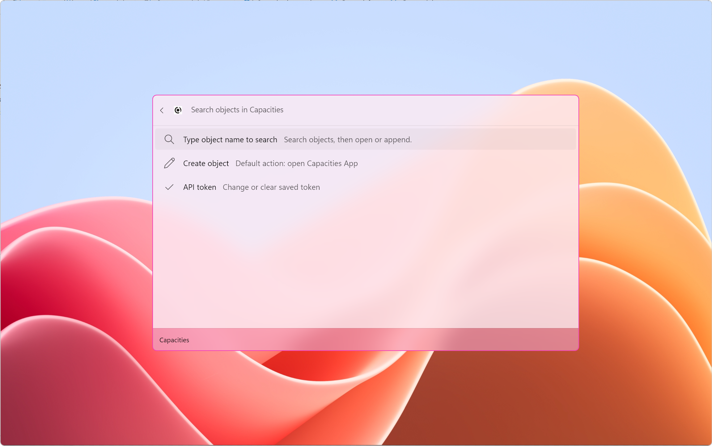
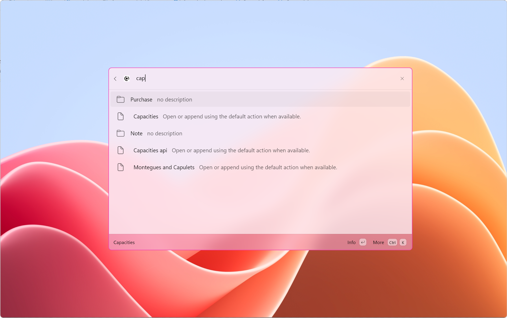
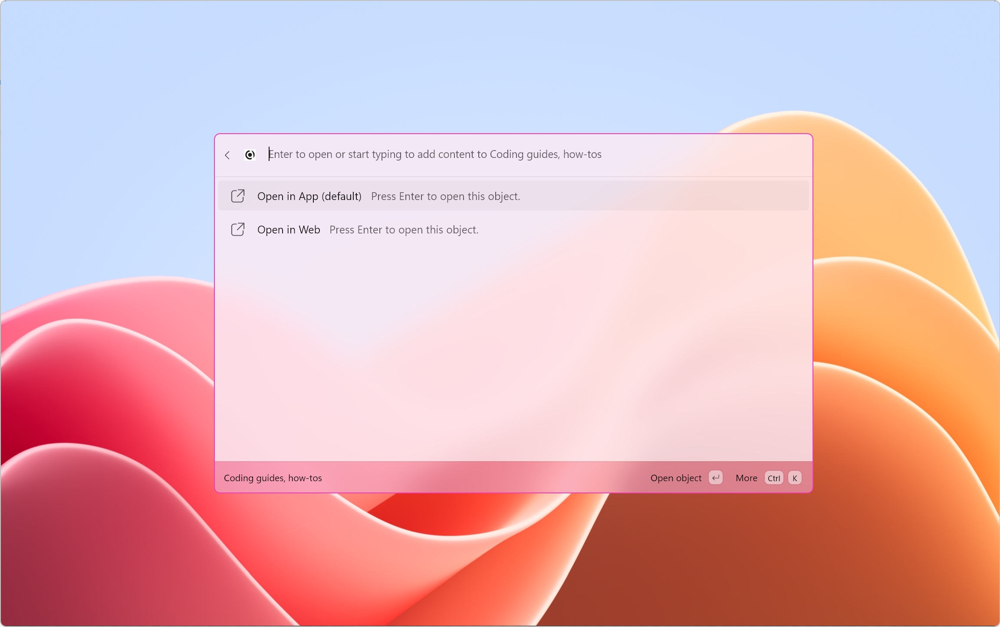

# CmdPal Capacities Extension

**Capacities integration for Windows Command Palette (PowerToys CmdPal)**

Search objects, open them, append text, and create new objects without leaving Command Palette.


## Current Status

- Microsoft Store submission accepted for the extension
- The project is moving forward with Store rollout and distribution follow-up
- WinGet and gallery distribution work remain in progress alongside Store availability

## Requirements

**You need a Capacities Pro subscription** to use this extension.

The extension requires API access to Capacities, which is only available with a **Capacities Pro** paid plan. Free accounts do not have API access.

→ [Get Capacities Pro](https://capacities.io/pricing)

## Quick Start

### Installation

```powershell
# Via WinGet
# Not available yet
winget install VectorRilke.CmdPal-Capacities

# Via Microsoft Store
# https://apps.microsoft.com/detail/9NSN399G59KM
```

If the extension is not yet available through WinGet on your machine, you can also install it directly from the Microsoft Store: [ms-windows-store://pdp/?productid=9NSN399G59KM](ms-windows-store://pdp/?productid=9NSN399G59KM)

Manual download from GitHub Releases is also available:
# https://github.com/vectorrilke/CmdPal-Capacities/releases

### Usage

1. Open Command Palette (PowerToys CmdPal)
2. Type the extension alias (default: `cap`)
3. Type at least 3 characters to search your Capacities objects
4. Select an object or action

## Screenshots

Search, create, and append objects without leaving Command Palette:







## Features

### Search & Access
- Search-first object lookup from Command Palette
- Results grouped by structure type (List, Page, etc.)
- Smart caching and debouncing for performance
- Transient error fallback behavior

### Object Actions
- Open in Capacities App
- Open in Capacities Web
- Append markdown text then open App
- Append markdown text then open Web
- Append text only (without opening)

### Object Creation
- Choose structure type
- Enter object name
- Enter markdown content or create blank object
- Post-create behavior: Open App, Open Web, or do nothing

### Authentication & Security
- API token stored securely (outside visible settings)
- Masked token display in UI
- Token validation before operations

### Search Resilience
- Minimum query length (3 characters)
- Request debouncing
- Response caching
- Rate-limit protection with automatic cooldown
- Graceful error handling

## Usage

Invoke the extension alias (for example: `cap`) and type at least 3 characters to search.

**Common workflows:**

1. **Search & Open**: Search object → choose object → choose action
2. **Create Object**: No query → Create object → enter details
3. **Set API Token**: No query → Set API token
4. **Create Blank**: Choose structure → enter name → press Enter (empty content)

For text entry, use escaped newlines with `\n` when needed.

## Current Limitations

The extension focuses on **search, open, append, and create** workflows for standard objects. Some advanced features like Tasks, Daily Notes, and media objects are not yet fully supported.

**Why?** The Capacities API is still evolving, and some object types require more stable API affordances. See [**API_LIMITATIONS.md**](API_LIMITATIONS.md) for detailed reasoning and future plans.

## Settings

| Setting | Options | Default |
|---------|---------|---------|
| Capacities API Token | Your API token from Capacities | (required) |
| After Create Object | Open App / Open Web / Do nothing | Open App |

## Roadmap

For roadmap of future versions, see [ROADMAP.md](ROADMAP.md)

## Support & Feedback

- [Issues & Bug Reports](https://github.com/vectorrilke/CmdPal-Capacities/issues)
- [Discussions](https://github.com/vectorrilke/CmdPal-Capacities/discussions)
- [@vectorrilke](https://twitter.com/vectorrilke)

## License

MIT License - see [LICENSE](LICENSE) for details

## Credits

- Built for **Windows Command Palette (PowerToys CmdPal)**
- Integrates with **Capacities** workspace platform
- Inspired by PowerToys community extensions

## Author

**Vector Rilke**  
[GitHub](https://github.com/vectorrilke) | [Twitter](https://twitter.com/vectorrilke)

---

**Have feedback?** Open an issue or start a discussion! 🚀
